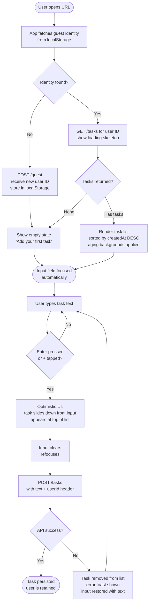
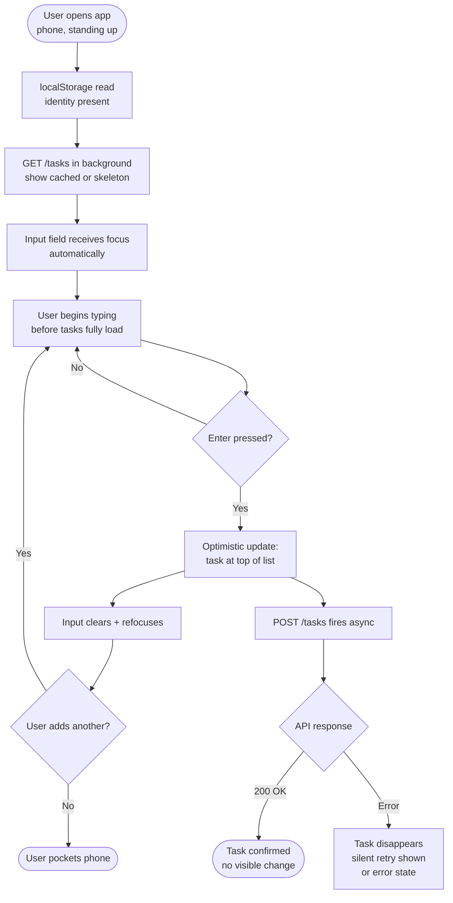
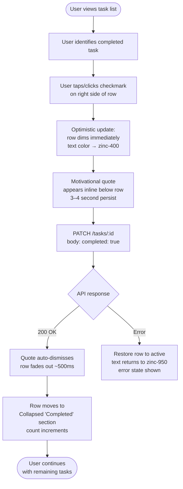
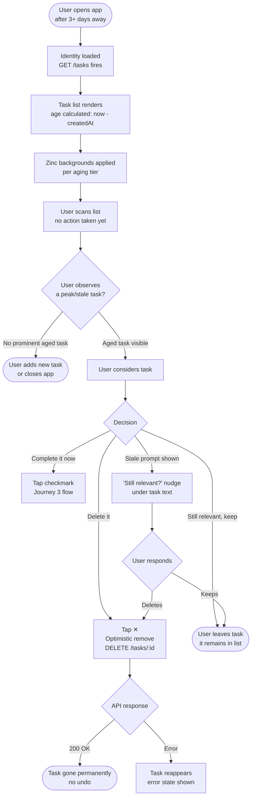

# UX Design Specification MotivaTodo

**Author:** Nearformer
**Date:** 2026-02-27

---

<!-- UX design content will be appended sequentially through collaborative workflow steps -->

## Executive Summary

### Project Vision

MotivaTodo is a zero-friction, speed-first task management web application for high-stakes professionals — lawyers, consultants, and anyone managing a high volume of micro-tasks with real consequences for forgetting them. The product delivers value before a single user decision is made: no sign-up, no configuration, no onboarding wall. A user lands on their task list and starts capturing immediately.

The core UX principle: **speed of capture is the product**. Every design decision must be evaluated against its impact on the time between "I need to remember this" and "it's captured."

### Target Users

**Primary — Marco (The Pressured Professional)**
Corporate lawyer, 38, managing 40+ client matters simultaneously. Uses the app one-handed on his phone in 10–90 second windows between meetings and court appearances. Has abandoned Notion, Todoist, and Apple Reminders — all were abandoned because adding a task took too long. Needs to capture a thought in under 10 seconds with zero friction.

**Secondary — Elena (The Skeptic)**
Junior associate, 31. Has quit three apps before. Will not invest any time before she sees value. Her first session must deliver a complete, satisfying experience within 30 seconds or she leaves forever.

### Key Design Challenges

1. **Perceived speed** — The add-todo interaction must feel instantaneous (< 50ms perceived via optimistic updates). Any latency between tap → task appearing must be invisible.
2. **Visual aging legibility** — The graduated highlight scale communicates urgency without causing anxiety. Every colour tier must be immediately readable and WCAG AA compliant, including the staleness state.
3. **Silent identity trust** — Users have no explicit confirmation their data is persisted. The UX must create confidence through consistency: every return visit shows the same list, every time.
4. **Quote moment balance** — Marking a task done triggers a motivational quote. This must feel rewarding, not interruptive. The quote presentation must not delay the next capture.

### Design Opportunities

1. **The empty state as hero onboarding** — A blank list with a single call-to-action is the most frictionless onboarding possible. No tutorial, no walkthrough. Design this screen to be irresistible.
2. **The input as centrepiece** — If adding a task is the entire value proposition, the input field is the most important element on the page. It deserves visual prominence and should always be visible without scrolling.
3. **The completion micro-celebration** — The motivational quote on task completion is a designed habit loop moment. The transition from active task → quote display → cleared input can be crafted into genuine delight.

## Core User Experience

### Defining Experience

The defining experience of MotivaTodo is a single interaction: **capturing a task in under 10 seconds**. Every other element of the product — the visual aging, the motivational quote, the anonymous identity model — exists to support this one moment or to reward it.

The experience must feel local. Even though all data is server-side, the UI must respond with the immediacy of a native app. Optimistic updates ensure that adding, completing, and deleting tasks happen at tap speed — the network is invisible.

### Platform Strategy

- **Primary surface:** Mobile web (iOS Safari, Chrome for Android) — one-handed use, portrait orientation, thumb reach determines layout
- **Secondary surface:** Desktop web — full functionality, comfortable reading width
- **Input model:** Touch-first; keyboard-optimised on desktop (Enter to submit, no mouse required)
- **No offline support** — online-only; graceful error state when connection is lost
- **No native apps in MVP** — progressive web delivery only

### App Identity Indicator

The app logo in the top-left corner is a single emoji that doubles as a silent identity status indicator:

| State                         | Emoji | Meaning                                              |
| ----------------------------- | ----- | ---------------------------------------------------- |
| No user ID yet (initialising) | 📭    | Empty mailbox — identity not yet assigned            |
| User ID set (identity ready)  | 📫    | Full mailbox — tasks are being saved to your account |

This gives users a subtle, non-intrusive signal that their data is persisted — without any text, badge, or modal. The transition from 📭 → 📫 is the only "your session is saved" confirmation the app ever shows.

### Effortless Interactions

The following interactions must require zero cognitive load:

| Interaction                       | Required Effort                                           |
| --------------------------------- | --------------------------------------------------------- |
| Starting to use the app           | Zero — no sign-up, no configuration, no onboarding        |
| Adding a task                     | Tap input → type → Enter. One flow, no decisions          |
| Seeing which tasks need attention | Automatic — visual aging shows it without any user action |
| Returning after days away         | List loads instantly with all tasks preserved             |
| Completing a task                 | Single tap on the checkmark on the right of the todo item |

### Interaction Choreography

**Adding a task:**
The new todo item slides down from the input field and attaches to the top of the todo list below the input section. The animation reinforces the spatial relationship — tasks flow down from the capture point into the list.

**Layout structure (top to bottom):**

1. App logo (📭 / 📫) — top left
2. Todo input field — always visible, anchored below the logo
3. Active todo list — items sorted newest first, directly below input
4. Collapsed completed section — below the active list, hidden by default

**Completing a task:**
Each todo item has a clear completion mark (checkmark) on the right side. Tapping it triggers:

1. The motivational quote appears immediately (overlay or inline)
2. The todo item slowly fades out and disappears from the active list
3. The item moves into the collapsed "Completed" section below the active list
4. The completed section is collapsed by default — users can expand to review done items

This keeps the active list clean and focused while preserving a record of accomplishments.

### Critical Success Moments

1. **First task captured** — Within 30 seconds of first visit, the user has added at least one task. The empty state must make this inevitable.
2. **Return visit recognition** — On second visit, the list is there before the user has to think. The 📭 → 📫 emoji transition is the silent confirmation that data is safe.
3. **The completion reward** — Tapping the checkmark → quote appears → item fades out gracefully. The quote must land before the item disappears.
4. **The aging signal** — On a return visit with older tasks, highlighted items immediately draw the eye to what needs attention.

### Experience Principles

1. **Speed is the feature** — If an interaction adds time or hesitation, it must be eliminated or made invisible.
2. **The list knows** — Tasks organise themselves over time. The system is intelligent so the user doesn't have to be.
3. **Trust through consistency** — Every return visit is identical: load → list appears → 📫 confirms persistence.
4. **Reward completion, not capture** — The habit loop closes on done, not on added. The quote is the payoff.
5. **Nothing before value** — No onboarding gate, no permission dialog, no tutorial stands between the user and their first captured task.
6. **Spatial logic** — Add at top, list flows down, completed sinks to the bottom. The UI has gravity that matches user mental models.

## Desired Emotional Response

### Primary Emotional Goals

**Primary:** Relief — the feeling of a thought safely captured and off the user's mind. Not excitement or delight; the dominant emotion is the absence of stress. A task in MotivaTodo cannot be forgotten.

**Secondary:** Accomplishment — the earned feeling when a task is marked done. The motivational quote is not decoration; it is the payoff of a closed loop.

**Tertiary:** Calm confidence — returning users should feel their list is under control. The visual aging surfaces what matters; the user doesn't need to think.

### Emotional Journey Mapping

| Stage                    | User State             | Target Emotion       | Design Response                                      |
| ------------------------ | ---------------------- | -------------------- | ---------------------------------------------------- |
| First visit, empty state | Sceptical, uncommitted | Pleasant surprise    | No gates, no friction — immediate value              |
| First task captured      | Mildly curious         | "That was easy"      | Slide-down animation confirms capture instantly      |
| 📭 → 📫 transition       | Passive                | Quiet reassurance    | Silent signal: your data is safe                     |
| Return visit, list loads | Familiar, routine      | Recognition and calm | List appears immediately, aged items guide attention |
| Task completion          | Purposeful             | Satisfaction         | Quote appears, item fades gracefully — closure       |
| Error state              | Worried                | Reassured            | Clear, human-language message; no data loss implied  |

### Micro-Emotions

| Micro-emotion        | Where it must appear               | Where to avoid                               |
| -------------------- | ---------------------------------- | -------------------------------------------- |
| **Confidence**       | Every return visit — list is there | During error states — don't alarm            |
| **Trust**            | The 📫 emoji moment                | Never show technical error messages          |
| **Accomplishment**   | The completion quote moment        | Avoid making it feel hollow or random        |
| **Urgency (gentle)** | Visual aging highlight tiers       | Staleness tier — warn, don't panic           |
| **Curiosity**        | Empty state call-to-action         | Don't create anxiety about uncompleted tasks |
| **Relief**           | Immediately after task capture     | Input submission should never feel uncertain |

### Design Implications

- **Relief through speed** → Optimistic updates are non-negotiable. The task must appear in the list before the API responds. Any visible latency breaks the "safely captured" feeling.
- **Accomplishment through ceremony** → The completion animation (fade out + quote) must be long enough to feel intentional — not instant — but short enough not to interrupt the next capture. Target: ~400–600ms fade, quote visible for 3–4 seconds.
- **Calm through visual hierarchy** → The aging highlight must guide the eye without demanding it. Amber is attention, not alarm. The staleness state is a question, not a warning siren.
- **Trust through the emoji** → The 📭 → 📫 transition must happen early and reliably. Users will notice if it stays 📭 too long.
- **Reassurance through error copy** → Error messages must never imply data loss. "Couldn't connect — your tasks are safe, please try again" is more important than the technical cause.

### Emotional Design Principles

1. **Relief is the product** — Every interaction should reduce mental load, never add to it.
2. **Ceremony earns satisfaction** — Completion deserves a moment. Don't rush the quote away.
3. **Warn with amber, not red** — Urgency should feel motivating. The aging system surfaces what needs attention; it does not create anxiety.
4. **Silent signals build trust** — The 📫 emoji does more trust-building than any "your data is saved" toast ever could.
5. **Error is temporary, data is permanent** — All error messaging must imply durability. The user's list is always safe.

## UX Pattern Analysis & Inspiration

### Inspiring Products Analysis

**Things 3 (Apple Design Award winner)**
Famed for speed of capture and visual clarity. The quick entry bar is always accessible; adding a task never requires navigating away from the current view. Key lesson: the capture surface is always one gesture away. Its clear spatial hierarchy also shows how a list can self-organise without user effort.

**Fantastical (Calendar + Reminders)**
Natural language input that interprets intent without requiring structured data entry. Lesson: the input field can be smarter than it looks. Zero-configuration capture that still produces structured data underneath.

**iA Writer (Focus writing app)**
Mastery of “nothing in the way” design. Every non-essential UI element disappears when you’re working. Lesson: the main action (capturing) gets full visual real estate. Everything else recedes.

**Apple iOS Reminders (completion animation)**
The gentle strikethrough + fade when marking an item done. A small ceremony that confirms closure without being disruptive. Lesson: completion animations should be satisfying but never slow the user down.

**Duolingo (habit loop + micro-rewards)**
The motivational quote in MotivaTodo serves the same psychological role as Duolingo’s XP celebration — a micro-reward that closes the habit loop. Lesson: the reward must feel earned and specific, not generic.

### Transferable UX Patterns

**Navigation Patterns:**

| Pattern                | Source                | Application to MotivaTodo                                           |
| ---------------------- | --------------------- | ------------------------------------------------------------------- |
| Persistent capture bar | Things 3, Fantastical | Input field always at top, never hidden behind navigation           |
| Single-surface focus   | iA Writer             | One screen, no tabs, no sidebar — the list is the whole app         |
| Spatial gravity        | Things 3              | New items appear at top, completed sink to bottom collapsed section |

**Interaction Patterns:**

| Pattern               | Source                  | Application to MotivaTodo                                 |
| --------------------- | ----------------------- | --------------------------------------------------------- |
| Slide-in confirmation | iOS Reminders, Todoist  | New task slides into list from input — spatial continuity |
| Graceful completion   | iOS Reminders           | Fade + move to completed section, ~400–600ms              |
| Micro-reward moment   | Duolingo                | Quote display on completion — 3–4s, then dismisses        |
| Silent state change   | iOS (network indicator) | 📭 → 📫 transition — no toast, no modal, just the emoji   |

**Visual Patterns:**

| Pattern                   | Source                   | Application to MotivaTodo                                  |
| ------------------------- | ------------------------ | ---------------------------------------------------------- |
| Progressive disclosure    | iOS (collapsed sections) | Completed todos collapsed by default, expandable           |
| Ambient urgency           | Heat maps, Trello aging  | Warm colour graduation for task age — amber, not red       |
| Empty state as invitation | Linear, Notion           | Empty list = clear CTA to add first task, not a blank void |

### Anti-Patterns to Avoid

| Anti-pattern                           | Why to avoid                                                                 |
| -------------------------------------- | ---------------------------------------------------------------------------- |
| **Onboarding wizard or tour**          | Delays the first task capture — value is immediate or it’s nothing           |
| **Confirmation dialogs on delete**     | Adds friction; optimistic delete with undo toast is the right pattern        |
| **Modal quote display**                | Blocks the list; inline or overlay that auto-dismisses is preferable         |
| **Red urgency colours**                | Creates anxiety, not motivation; amber/warm tones for aging are sufficient   |
| **Swipe-to-complete (primary action)** | Swipe is discoverability-dependent; checkmark on the right is always visible |
| **Toasts for every API success**       | Noise; only show feedback for failures and the completion quote              |
| **Registration prompt as modal**       | Blocks the user; a dismissible banner or subtle indicator is correct         |

### Design Inspiration Strategy

**Adopt directly:**

- Things 3’s persistent-input-at-top layout — the capture bar never moves
- iOS Reminders’ completion animation duration and style (fade + move)
- iA Writer’s “everything else recedes” philosophy — the list is the UI

**Adapt for MotivaTodo:**

- Duolingo’s micro-reward: adapt to quote display rather than XP animation — static text, clean typography, auto-dismiss after 3–4s
- Fantastical’s smart input: keep plain text only in MVP, leave room for NLP enhancement in future

**Avoid entirely:**

- Any onboarding, tour, or configuration screen
- Any colour from the red/error spectrum for task aging
- Any confirmation dialog that blocks a core action

## Design System Foundation

### Design System Choice

**Selected:** shadcn/ui + Tailwind CSS (React 19, TypeScript)

shadcn/ui is a themeable, copy-owned component library built on Radix UI primitives with Tailwind CSS styling. Components are owned by the project — copied into `frontend/src/components/ui/` — and can be freely customised. This is not a traditional dependency-locked design system; it is a foundation.

### Rationale for Selection

1. **Accessibility by default** — Radix UI primitives handle keyboard navigation, ARIA attributes, and focus management out of the box. This directly satisfies FR25, FR27, NFR11–NFR14 without manual implementation.
2. **Full visual control** — Tailwind utility classes give complete control over the visual aging gradient, the completion fade animation, and the spatial layout. No overriding third-party CSS specificity.
3. **No aesthetic baggage** — MotivaTodo’s UI should feel like MotivaTodo, not like a Material or Ant Design app. shadcn/ui is visually neutral by default.
4. **Appropriate component set** — The core required components (Input, Button, Collapsible for completed section, Badge or custom div for aging) are all available and composable.
5. **Performance** — Tailwind’s tree-shaking and shadcn’s component ownership ensure no unused CSS or JavaScript ships to users.

### Implementation Approach

- Initialise shadcn/ui in `frontend/` with the neutral base theme
- Copy only the components needed: `Input`, `Button`, `Collapsible`, `Badge` (minimal footprint)
- Define design tokens in `tailwind.config.ts`: colour palette, animation durations, font stack
- All visual aging tiers implemented as Tailwind utility classes driven by CSS custom properties (e.g., `--aging-intensity: 0..100`)

### Customisation Strategy

| Element                   | Approach                                                                                                  |
| ------------------------- | --------------------------------------------------------------------------------------------------------- |
| **Colour palette**        | Neutral base (slate/zinc) + amber accent scale for visual aging tiers                                     |
| **Typography**            | System font stack (no custom font load — performance first) or a single clean sans-serif via CSS variable |
| **Visual aging gradient** | Custom Tailwind utilities: `bg-aging-0` through `bg-aging-100` driven by computed intensity value         |
| **Staleness state**       | Reduced amber intensity + contextual prompt — distinct from urgency tiers                                 |
| **Completion animation**  | Tailwind `transition-opacity duration-500` + `translate-y` slide into collapsed section                   |
| **Identity emoji**        | Plain text emoji in a fixed top-left position — no component needed                                       |
| **Quote display**         | Inline banner below the completed item before fade, auto-dismisses after 3–4s                             |

## Core User Experience

### Defining Experience

**MotivaTodo's defining experience:** _Type a thought. It's captured._

The core interaction is: tap the input → type → press Enter → the new task slides into the top of the list. No button to find, no category to choose, no confirmation to dismiss. The user's mental focus returns to whatever they were doing before. The task will not be forgotten.

This is the interaction that users will describe to colleagues. Not "it has a nice design" or "it has good features" — but "I opened it, typed, and it was done in 10 seconds."

### User Mental Model

Users arriving at MotivaTodo carry a mental model shaped by notes apps (Apple Notes, Google Keep) and failed TODO apps (Todoist, Things, Notion). Their prior experience creates both expectations and scepticism:

**What they expect:**

- Some kind of sign-up or configuration before the app is useful
- A list they'll have to organise manually
- Adding a task to involve at least 2–3 taps (open add view, type, confirm)

**What they don't expect (and what creates the "this is different" moment):**

- The list is already there on arrival — no setup required
- The input field is the first thing they see — capture is the invitation
- The task appears in the list before their finger leaves the screen

**Where they're likely to be confused:**

- "Is my data actually saved?" → resolved by the 📭 → 📫 transition
- "What happens if I close the browser?" → resolved by list persisting on return visit
- "Will this still be here tomorrow?" → only answered by the second visit

### Success Criteria for Core Interaction

| Criteria          | Definition of Success                                     |
| ----------------- | --------------------------------------------------------- |
| **Speed**         | Time from app open to task captured: < 10 seconds         |
| **Confidence**    | User does not hesitate before pressing Enter              |
| **Confirmation**  | Task appears in list before perceived delay               |
| **Zero friction** | No decision required between intent and capture           |
| **Return trust**  | List is identical on second visit — no explanation needed |

### Novel UX Patterns

MotivaTodo combines two novel patterns within familiar interaction frameworks:

**1. Zero-Decision Identity (novel)**
Users expect to create an account before their data is saved. MotivaTodo inverts this — identity is assigned silently on first request. The 📭 → 📫 emoji is a new visual metaphor for "your anonymous session is active."

_Teaching strategy:_ Don't teach it. The 📫 emoji is self-evident. Users who notice it understand it. Users who don't simply trust that their list persists (which it does).

**2. Passive Prioritisation via Visual Aging (novel)**
Most TODO apps require manual priority assignment. MotivaTodo's graduated amber scale makes urgency visible without any user action.

_Teaching strategy:_ Don't explain it on arrival. Let users discover it on their second or third visit when older tasks begin to glow. The staleness prompt ("Is this task still ongoing?") is the only explicit signal — a question, not an instruction.

### Experience Mechanics

**Core flow: Adding a task**

| Stage           | User action                                            | System response                                                                            |
| --------------- | ------------------------------------------------------ | ------------------------------------------------------------------------------------------ |
| **Initiation**  | App loads; input field is focused or prominently empty | Cursor blinks in input — no instruction needed                                             |
| **Interaction** | User types task text                                   | Standard text input — no special handling                                                  |
| **Submission**  | User presses Enter (or taps Add button on mobile)      | Optimistic update: item slides down from input into top of list (~200ms animation)         |
| **Feedback**    | Task visible at top of list                            | Input field clears and refocuses — ready for next capture                                  |
| **Background**  | —                                                      | API call completes; on success nothing changes; on failure item is removed and error shown |

**Core flow: Completing a task**

| Stage           | User action                                    | System response                                                             |
| --------------- | ---------------------------------------------- | --------------------------------------------------------------------------- |
| **Initiation**  | User sees checkmark on right side of todo item | Checkmark is always visible — no hover/swipe required                       |
| **Interaction** | User taps/clicks checkmark                     | Optimistic update: item dims immediately                                    |
| **Ceremony**    | —                                              | Motivational quote appears inline below item (3–4s display)                 |
| **Completion**  | Quote auto-dismisses                           | Item fades out (~500ms) and slides into collapsed "Completed" section below |
| **Background**  | —                                              | API call completes; on failure item is restored to active list              |

**Core flow: Deleting a task**

| Stage               | User action                           | System response                                |
| ------------------- | ------------------------------------- | ---------------------------------------------- |
| **Initiation**      | User sees delete control on todo item | Visible on mobile (always shown) and desktop   |
| **Interaction**     | User taps/clicks delete               | Optimistic update: item disappears immediately |
| **Background**      | —                                     | API call completes; on failure item reappears  |
| **No confirmation** | —                                     | No "Are you sure?" dialog — speed over safety  |

---

## Visual Design Foundation

### Color System

MotivaTodo uses a **pure monochrome palette**. There are no accent colours. The entire visual language is built on the zinc scale from Tailwind CSS — white through near-black. This restraint is intentional: colour is reserved exclusively for meaning in the task-aging system.

#### Base Palette

| Token                  | Tailwind class    | Hex       | Usage                                  |
| ---------------------- | ----------------- | --------- | -------------------------------------- |
| `color-background`     | `bg-white`        | `#ffffff` | App background, fresh task background  |
| `color-surface`        | `bg-zinc-50`      | `#fafafa` | Subtle surface differentiation         |
| `color-border`         | `border-zinc-200` | `#e4e4e7` | Default borders                        |
| `color-text-primary`   | `text-zinc-950`   | `#09090b` | Primary text, todo content             |
| `color-text-secondary` | `text-zinc-500`   | `#71717a` | Metadata, counts, secondary labels     |
| `color-text-disabled`  | `text-zinc-400`   | `#a1a1aa` | Completed task text with strikethrough |
| `color-interactive`    | `bg-zinc-900`     | `#18181b` | Buttons, focus rings, primary controls |

#### Visual Aging Tiers

The aging system is the product's primary differentiator. Background colour shifts along the zinc scale as tasks age, creating passive priority pressure without explicit labels.

| Tier    | Age               | Background class                | Hex                | Perceived feel                 |
| ------- | ----------------- | ------------------------------- | ------------------ | ------------------------------ |
| Fresh   | 0–1 days          | `bg-white`                      | `#ffffff`          | Clean, new                     |
| Aging-1 | 1–3 days          | `bg-zinc-50`                    | `#fafafa`          | Barely visible shift           |
| Aging-2 | 3–7 days          | `bg-zinc-100`                   | `#f4f4f5`          | Noticeably off-white           |
| Aging-3 | 7–14 days         | `bg-zinc-200`                   | `#e4e4e7`          | Clearly aged                   |
| Aging-4 | 14–30 days        | `bg-zinc-300`                   | `#d4d4d8`          | Prominently grey               |
| Peak    | 30+ days          | `bg-zinc-400`                   | `#a1a1aa`          | Maximum age signal             |
| Stale   | 30+ days (prompt) | `bg-zinc-200` + `border-dashed` | `#e4e4e7` + dashed | Backed off, flagged with nudge |

> The staleness tier uses `bg-zinc-200` (backed off from peak) paired with a `border-dashed border-zinc-400` border to visually distinguish "needs attention" from simply "very old".

#### Interactive States

| State           | Visual treatment                              |
| --------------- | --------------------------------------------- |
| Focus           | `ring-2 ring-zinc-900 ring-offset-2`          |
| Hover (desktop) | `bg-zinc-50` transition on active tasks       |
| Completed text  | `text-zinc-400 line-through`                  |
| Disabled        | `opacity-50 cursor-not-allowed`               |
| Input active    | `border-zinc-900` (default `border-zinc-200`) |

---

### Typography System

MotivaTodo loads **no custom fonts**. The system font stack provides instant render, respects user preferences, and feels native on every platform. Type scale is minimal by design.

#### Font Stack

```css
font-family:
  ui-sans-serif,
  system-ui,
  -apple-system,
  BlinkMacSystemFont,
  "Segoe UI",
  Roboto,
  "Helvetica Neue",
  Arial,
  sans-serif;
```

#### Type Scale

| Role               | Size            | Weight        | Class                                                        | Usage                            |
| ------------------ | --------------- | ------------- | ------------------------------------------------------------ | -------------------------------- |
| Todo text          | 16px / 1rem     | 400           | `text-base font-normal`                                      | Active task content              |
| Todo completed     | 16px / 1rem     | 400           | `text-base font-normal text-zinc-400 line-through`           | Completed task content           |
| Input placeholder  | 16px / 1rem     | 400           | `text-base text-zinc-400`                                    | Add-task placeholder             |
| Motivational quote | 14px / 0.875rem | 400 italic    | `text-sm italic text-zinc-500`                               | Quote below completed task       |
| Staleness prompt   | 12px / 0.75rem  | 400           | `text-xs text-zinc-500`                                      | "Still relevant?" nudge          |
| Section header     | 12px / 0.75rem  | 500 uppercase | `text-xs font-medium uppercase tracking-wider text-zinc-400` | "Completed" section toggle label |
| Count badge        | 12px / 0.75rem  | 500           | `text-xs font-medium text-zinc-500`                          | Task count display               |

> Line height: `leading-relaxed` (1.625) for todo text to support comfortable scanning of multi-line tasks.

---

### Spacing & Layout Foundation

#### Layout Structure

```
+------------------------------------------+
|  📭  MotivaTodo          [icon] [icon]   |  <- Header h-14, px-4
+------------------------------------------+
|                                          |
|  +--------------------------------+      |
|  |  Add a task...           [+]   |      |  <- Input h-12, max-w-lg
|  +--------------------------------+      |
|                                          |
|  +--------------------------------+      |
|  |  O  Fresh task (white bg) [x] |      |  <- Task item min-h-[44px]
|  +--------------------------------+      |
|  |  O  Aging task (zinc-100) [x] |      |
|  +--------------------------------+      |
|  |  O  Old task (zinc-300)   [x] |      |
|  +--------------------------------+      |
|                                          |
|  > Completed (3)                         |  <- Collapsed by default
|                                          |
+------------------------------------------+
```

#### Layout Tokens

| Token                     | Value     | Tailwind       | Usage                            |
| ------------------------- | --------- | -------------- | -------------------------------- |
| `layout-max-width`        | 512px     | `max-w-lg`     | Content column max width         |
| `layout-gutter`           | 16px      | `px-4`         | Horizontal page margin           |
| `layout-header-height`    | 56px      | `h-14`         | Top navigation bar               |
| `layout-input-height`     | 48px      | `h-12`         | Add-task input row               |
| `layout-task-min-height`  | 44px      | `min-h-[44px]` | Minimum touch target per task    |
| `layout-task-padding`     | 12px/16px | `py-3 px-4`    | Task item internal padding       |
| `layout-section-gap`      | 8px       | `gap-2`        | Space between list items         |
| `layout-page-padding-top` | 24px      | `pt-6`         | Space below header to first item |

---

### Accessibility Considerations

#### Contrast Ratios (WCAG AA minimum 4.5:1 for normal text)

| Foreground               | Background     | Ratio  | Status                    |
| ------------------------ | -------------- | ------ | ------------------------- |
| `zinc-950` on `white`    | Fresh tasks    | ~19:1  | WCAG AAA pass             |
| `zinc-950` on `zinc-50`  | Aging-1 tasks  | ~17:1  | WCAG AAA pass             |
| `zinc-950` on `zinc-100` | Aging-2 tasks  | ~14:1  | WCAG AAA pass             |
| `zinc-950` on `zinc-200` | Aging-3 tasks  | ~10:1  | WCAG AAA pass             |
| `zinc-950` on `zinc-300` | Aging-4 tasks  | ~8:1   | WCAG AA pass              |
| `zinc-950` on `zinc-400` | Peak tasks     | ~7:1   | WCAG AA pass              |
| `zinc-400` on `white`    | Completed text | ~2.5:1 | Intentional — de-emphasis |

> The completed task text (`zinc-400` on white) intentionally falls below WCAG AA. Completed tasks are visually subordinate. The strikethrough + colour combination communicates state without requiring full readability.

#### Focus & Keyboard Navigation

- All interactive elements receive `ring-2 ring-zinc-900 ring-offset-2` focus indicator
- Tab order follows visual order: header controls → add input → task list top-to-bottom → completed section toggle
- Escape key dismisses any open state
- Enter submits add-task form

#### Touch Targets

- All interactive controls meet 44×44px minimum (iOS HIG + WCAG 2.5.5)
- Task checkbox: `min-h-[44px] min-w-[44px]` click zone even if visual icon is smaller
- Delete control: always visible on mobile (no hover-only pattern)

#### Screen Reader Support

- Motivational quote: `role="status"` aria live region (polite) — announced when it appears
- Task count: `aria-live="polite"` on count element
- Aging tier: conveyed visually only (no ARIA label for tier — aging is ambient, not critical information)
- Completed section toggle: `aria-expanded` state, `aria-controls` referencing list id

---

## Design Direction Decision

### Design Directions Explored

Six structural directions were generated and visualised in an interactive HTML showcase (`ux-design-directions.html`). All directions shared the same monochrome zinc palette, system font stack, and visual aging tiers — the variable was the **structural metaphor**:

| #   | Direction     | Structural metaphor                              |
| --- | ------------- | ------------------------------------------------ |
| 1   | Minimal Line  | Invisible chrome — borderless rows on white      |
| 2   | Ruled Lines   | Legal pad / newspaper with bold 2px rules        |
| 3   | Card Stack    | Rounded cards on zinc-100 background             |
| 4   | Inset Panel   | Floating white panel on zinc-200 background      |
| 5   | Type-Forward  | 18px task text, editorial scale                  |
| 6   | Intensity Bar | 4px left-edge age bar, all-white row backgrounds |

### Chosen Direction

**Direction 1 — Minimal Line**, with a secondary influence from **Direction 5 — Type-Forward** for the input treatment.

The task list is the entire product. The app renders as a white canvas with no cards, no containers, no chrome. Task rows carry the zinc aging gradient as the only visual layer. The input field uses a subtle border that activates to full zinc-950 on focus — no button required on desktop (Enter to submit), with a visible `[+]` affordance on mobile.

### Design Rationale

- **Signal purity**: With no competing visual elements, the aging gradient is experienced as the primary language of the interface. A task at `bg-zinc-400` is unmistakable against a fresh `bg-white` task two rows above it.
- **Lawyer context**: Legal professionals work in Word, PDF, and email — clean, text-first environments. A minimal chrome UI feels like a tool, not an app.
- **Zero distraction**: The product's thesis is zero-friction capture and passive prioritisation. Structural chrome would compete with that thesis.
- **shadcn/ui alignment**: Direction 1 maps directly to plain `div` + Tailwind classes with minimal shadcn/ui component overhead — easiest to implement faithfully.

### Implementation Approach

- Task rows: unstyled `div` with `flex items-center` + zinc `bg-*` class applied dynamically based on `createdAt` age
- No card border on normal tasks; `border border-dashed border-zinc-400` on stale tasks only
- Input: `border border-zinc-200` default, `border-zinc-900` on focus, `ring-0` (no ring on input itself)
- Header: minimal `flex justify-between` with `border-b border-zinc-100`
- Completed section: controlled `div` with `aria-expanded` chevron toggle
- All animations via Tailwind `transition-colors duration-200` on row backgrounds

---

## User Journey Flows

Three critical journeys from the PRD inform the detailed interaction design. Each is mapped as a flow diagram covering entry points, decision nodes, system responses, and recovery paths.

---

### Journey 1 — First Visit & First Task (Elena, new sceptical user)

**Goal:** Reach a captured task in under 30 seconds with zero friction.



**Key design decisions:**

- Auto-focus on load means the first keyboard tap is content — not navigation
- Empty state CTA is the input field's placeholder — no separate "get started" button
- No loading spinner blocks interaction — skeleton shows, input is usable immediately

---

### Journey 2 — Speed Capture (Marco, returning user, 60-second window)

**Goal:** Open app, capture a deliverable, close app — all under 10 seconds.



**Key design decisions:**

- The list loading in the background must not block or shift the input position
- Optimistic update fires immediately — the user should never wait to see their task
- POST is fire-and-forget from the user's perspective; only on failure does UI react

---

### Journey 3 — Completion & Motivational Moment (Marco, task done)

**Goal:** Mark a task complete; receive an emotional payoff; continue.



**Quote display pattern:**

- Quote role: `role="status"` aria live region — screen readers announce it politely
- Quote source: pulled from a curated bank of ~30 short quotes (stored on frontend)
- Quote selection: randomised per completion event — same quote should not repeat consecutively

---

### Journey 4 — Visual Aging Review (Marco, end-of-week glance)

**Goal:** Open the app after a few days; let the aging system surface forgotten tasks passively.



**Staleness nudge logic:**

- Trigger: task has been in `bg-zinc-400` (30+ days) for a further 2+ days (32+ total)
- Display: small `text-xs text-zinc-500` line "Still relevant?" below task text
- No button — the existing complete / delete controls handle the response
- Nudge resets if user touches the task (re-sorts to top, aging restarts)

---

### Journey Patterns

Across all four journeys, three reusable interaction patterns emerge:

#### Pattern 1 — Optimistic Everything

Every destructive or mutating action (add, complete, delete) fires UI changes immediately before the API responds. Recovery only happens on error. This pattern is non-negotiable for the 10-second capture goal.

**Rules:**

- UI never waits for API before showing result
- API errors trigger a visible but non-blocking recovery state
- No loading spinners on primary actions — only on initial page load

#### Pattern 2 — Silent System Work

Authentication (guest ID assignment), persistence, and aging calculations are entirely invisible to the user. The system works; the user just uses the list.

**Rules:**

- No "saving…" indicators
- No onboarding flow or setup required
- Aging tier change happens on next page load — never mid-session

#### Pattern 3 — Single Recovery Surface

Every error state returns the UI to the state it was in before the action — input restores text, deleted item reappears, completed item returns to active. There is one error per action; errors do not stack.

**Rules:**

- Recovery is automatic — no error modal requiring a click
- Error message lives inline, near the failed element
- Auto-dismiss after 4 seconds if user takes no action

---

### Flow Optimisation Principles

1. **Minimum steps to value**: First task captured in ≤ 3 taps (open → tap input → type → Enter). Zero setup between URL and first task.
2. **No dead ends**: Every path has a recovery route. No user action leads to a state the user cannot exit without a page reload.
3. **Ambient prioritisation**: The aging system requires no user action. The list self-organises its urgency signal purely through visual state.
4. **Completion as reward, not chore**: The motivational quote makes task completion feel like an event, not a checkbox — supporting the emotional design goal of relief + accomplishment.
5. **Predictable interactions**: Checkmark always on right. Delete always visible. Input always at top. Users build muscle memory after 2–3 sessions.

---

## Component Strategy

### Design System Components

shadcn/ui + Tailwind CSS provides the following foundation components used directly:

| Component           | shadcn/ui source              | Usage in MotivaTodo                   |
| ------------------- | ----------------------------- | ------------------------------------- |
| `Input`             | `@/components/ui/input`       | Add-task text field                   |
| `Button`            | `@/components/ui/button`      | Mobile `[+]` submit button            |
| `Separator`         | `@/components/ui/separator`   | Optional header rule                  |
| `Toast` / `Toaster` | `@/components/ui/toast`       | Error recovery messages (API failure) |
| `Collapsible`       | `@/components/ui/collapsible` | Completed tasks section open/close    |

All five are used with minimal customisation — primarily Tailwind class overrides to align with the zinc-only colour palette. No shadcn/ui component receives a new variant; overrides are applied via `className` props only.

---

### Custom Components

Five custom components cover everything shadcn/ui cannot provide:

#### 1. `TaskItem`

**Purpose:** Renders a single active todo with aging background, checkmark, text, and delete control.

**Anatomy:**

```
[bg-zinc-*]  O [task text .............] [x]
             ^   ^                        ^
          check  text (flex-1)          delete
```

**Props:**

- `task: { id, text, createdAt, completed }`
- `onComplete: (id) => void`
- `onDelete: (id) => void`

**States:**

| State           | Visual                                                         |
| --------------- | -------------------------------------------------------------- |
| Default         | Aging bg, zinc-950 text, visible delete on mobile              |
| Hover (desktop) | `bg-zinc-50` overlay transition                                |
| Completing      | `opacity-50` + `text-zinc-400`, checkmark fills                |
| Stale           | `border border-dashed border-zinc-400` + staleness nudge shown |

**Aging background logic:**

```ts
function getAgingClass(createdAt: string): string {
  const days = differenceInDays(new Date(), new Date(createdAt));
  if (days <= 1) return "bg-white";
  if (days <= 3) return "bg-zinc-50";
  if (days <= 7) return "bg-zinc-100";
  if (days <= 14) return "bg-zinc-200";
  if (days <= 30) return "bg-zinc-300";
  return "bg-zinc-400"; // peak
}
```

**Accessibility:** `role="listitem"`, delete button `aria-label="Delete task"`, complete button `aria-label="Mark complete"`.

---

#### 2. `TaskList`

**Purpose:** Renders the ordered list of active `TaskItem` components. Manages optimistic state for add/complete/delete.

**Anatomy:** Unstyled `ul` with `flex flex-col` — no gap, no padding. Spacing comes from `TaskItem` own `min-h-[44px]`.

**Props:**

- `tasks: Task[]` — sorted by `createdAt` DESC
- `onComplete: (id) => void`
- `onDelete: (id) => void`

**States:**

| State     | UI                                                    |
| --------- | ----------------------------------------------------- |
| Loading   | 3 placeholder skeleton rows (zinc-100 animated pulse) |
| Empty     | `"Nothing here. Add your first task above."`          |
| Populated | Ordered list of `TaskItem`                            |

---

#### 3. `CompletionCeremony`

**Purpose:** Displays a motivational quote inline below a just-completed task for 3–4 seconds, then unmounts.

**Anatomy:**

```
TaskItem (dimming)
  └── [quote text italic zinc-500]   <- CompletionCeremony
```

**Props:**

- `quote: string`
- `onDismiss: () => void` (called after 3500ms or on user tap)

**States:**

| State    | Visual                                          |
| -------- | ----------------------------------------------- |
| Entering | Fade in `opacity-0` to `opacity-100` over 200ms |
| Visible  | `italic text-sm text-zinc-500 py-2 px-4`        |
| Exiting  | Fade + slide up, then parent task also fades    |

**Accessibility:** `role="status"` — politely announced by screen readers.

---

#### 4. `StalenessNudge`

**Purpose:** Renders a passive "Still relevant?" line below a stale task (30+ days at peak tier for 48+ hours).

**Anatomy:**

```
TaskItem (bg-zinc-200, dashed border)
  └── [Still relevant?]   <- StalenessNudge
```

**Props:** None (rendered conditionally by `TaskItem` when staleness threshold met).

**Display:** `text-xs text-zinc-500 py-1 pl-8` — indented to align with task text.

**Accessibility:** Not announced by screen reader — purely ambient. The delete/complete controls handle all action.

---

#### 5. `AppHeader`

**Purpose:** Renders the top bar with emoji logo, app name, and task count.

**Anatomy:**

```
📭 MotivaTodo              [3 tasks]
```

**Props:**

- `userId: string | null` — determines emoji (📭 no ID, 📫 ID present)
- `taskCount: number`

**States:**

| State        | Emoji |
| ------------ | ----- |
| No identity  | 📭    |
| Identity set | 📫    |

> The emoji swap is the only non-text identity signal in the UI. No auth state label is displayed.

---

### Component Implementation Strategy

- All custom components are **React functional components** with TypeScript props interfaces
- Styling is exclusively **Tailwind CSS utility classes** — no CSS modules, no inline styles
- shadcn/ui components are imported from `@/components/ui/` and used with `className` overrides only
- Animation uses Tailwind `transition-*` and `duration-*` utilities — no animation library
- `date-fns` `differenceInDays()` computes aging tier on render — not stored in the database

---

### Implementation Roadmap

**Phase 1 — Core (first usable render):**

- `AppHeader`
- `TaskList` with loading + empty states
- `TaskItem` with aging background
- shadcn/ui `Input` for add-task

**Phase 2 — Completion Loop (emotional design):**

- `CompletionCeremony` with motivational quote
- shadcn/ui `Collapsible` for completed tasks section

**Phase 3 — Passive Prioritisation (core value prop):**

- Stale task detection + dashed border in `TaskItem`
- `StalenessNudge` inline text component

**Phase 4 — Error Resilience:**

- shadcn/ui `Toast` / `Toaster` for API failure recovery messages

---

## UX Consistency Patterns

### Button Hierarchy

MotivaTodo has no traditional button hierarchy. Actions are categorised by **type** and **destructiveness**:

| Action                   | Visual form                                 | Interaction trigger                 |
| ------------------------ | ------------------------------------------- | ----------------------------------- |
| Add task                 | Enter key (desktop) / `+` icon tap (mobile) | Submit on form field                |
| Complete task            | Circle checkmark on right of task           | Tap/click the mark-complete control |
| Delete task              | `x` icon on right of task                   | Tap/click the delete control        |
| Expand completed section | `>` chevron + label                         | Tap/click the section header row    |

**Rules:**

- No destructive confirmation dialogs — delete is immediate with optimistic removal
- No floating action button — the input field is the primary action surface
- The `+` mobile button uses shadcn/ui `Button` with `size="icon"` + `bg-zinc-950 text-white` — the only filled button in the product
- All other action controls are unstyled icon buttons with `aria-label`

---

### Feedback Patterns

| Trigger               | Feedback                                     | Form                                         | Duration                  |
| --------------------- | -------------------------------------------- | -------------------------------------------- | ------------------------- |
| Task added            | None (optimistic — task visible immediately) | —                                            | —                         |
| Task completed        | Motivational quote inline                    | `text-sm italic text-zinc-500` below item    | 3–4 seconds, auto-dismiss |
| Task deleted          | None (optimistic — item gone)                | —                                            | —                         |
| API error on add      | Input restores text; task removed            | Toast: `"Couldn't save — try again"`         | 4 seconds                 |
| API error on complete | Item restored to active state                | Toast: `"Couldn't complete task"`            | 4 seconds                 |
| API error on delete   | Item reappears in list                       | Toast: `"Couldn't delete task"`              | 4 seconds                 |
| Initial load error    | Skeleton replaced with error state           | Inline: `"Couldn't load your tasks"` + retry | Persistent until retry    |

**Rules:**

- Success feedback is ambient or content-based (the quote) — never a green toast
- Error feedback is always a shadcn/ui `Toast` bottom-right, zinc-950 background, white text
- No persistent error banners — all errors are transient or inline
- Toast `role="alert"` — screen readers announce errors immediately

---

### Form Patterns

MotivaTodo has one form: the add-task input.

**Rules:**

- Placeholder: `"Add a task…"` — lowercase, no punctuation
- Auto-focus on page load (desktop only — mobile respects native scroll behaviour)
- `maxLength` 280 characters; character counter `"N characters left"` appears only at 260+: `text-xs text-zinc-400`
- Enter submits; Shift+Enter does nothing (tasks are single-line)
- Empty or whitespace-only submission is silently ignored (no error state)
- After submit: input clears and refocuses within the same tick
- No server-side validation errors surfaced for this field

---

### Navigation Patterns

MotivaTodo is a single-page application with no navigation.

**Rules:**

- No sidebar, tab bar, or breadcrumb
- Browser back button has no in-app behaviour
- The only "navigation" is vertical scroll on the task list
- Deep linking is not supported in MVP — all URLs resolve to the same view

---

### Empty States & Loading States

#### Empty state (no tasks)

- Input field auto-focused
- Below input: `"Nothing here yet. Add your first task above."` — `text-sm text-zinc-400 text-center mt-8`
- No illustration, no icon, no onboarding wizard

#### Loading state (initial fetch)

- Input field usable immediately (not blocked)
- Three skeleton rows: `bg-zinc-100 animate-pulse h-[44px] w-full`, decreasing opacity (100%, 70%, 40%)
- If user submits during load: optimistic task prepended above skeletons; skeletons replaced when fetch resolves

#### Error state (fetch failed)

- Input field usable
- Inline: `"Couldn't load your tasks."` + `"Try again"` link in `text-sm text-zinc-500`
- Retry re-fires `GET /tasks`; user can add tasks in this state

---

### Additional Patterns

#### Completed Section Toggle

- Collapsed by default, expands inline below active list
- Trigger label: `"Completed (N)"` — `text-xs uppercase tracking-wider text-zinc-400`
- Chevron rotates 90° on open: `transition-transform duration-200`
- Completed tasks inside: `text-zinc-400 line-through bg-white` — aging does not apply
- `aria-expanded` on trigger, `aria-controls` on list container

#### Optimistic Update Pattern

All mutations follow this exact sequence:

1. User acts → UI updates immediately
2. API call fires async in background
3. On success → no visual change (UI already correct)
4. On failure → UI reverts + Toast error shown

Applied consistently to add, complete, and delete. No exceptions.

#### Motivational Quote Bank

- ~30 curated short quotes stored in a frontend constant array
- Randomly selected per completion event; no consecutive repeat
- Maximum 80 characters per quote
- English only in MVP
- Examples: _"The secret of getting ahead is getting started."_ / _"Done is better than perfect."_

---

## Responsive Design & Accessibility

### Responsive Strategy

MotivaTodo uses a **mobile-first, single-column layout** on all screen sizes. There are no multi-column layouts, no side navigation, and no device-specific feature splits. The design adapts only in:

1. **Column width** — full-width on mobile, constrained to `max-w-lg` (512px) and centred on desktop
2. **Input submit affordance** — `[+]` button always visible on mobile; Enter key on desktop (button still focusable)
3. **Delete control visibility** — always visible on mobile; visible on hover on desktop only
4. **Touch target enforcement** — critical on mobile, applied universally

This is intentional. The PRD persona (Marco, mobile between meetings) and the core UX principle (type a thought, captured) do not benefit from a richer desktop layout. The product should feel identical across devices — familiarity is the point.

---

### Breakpoint Strategy

Using Tailwind CSS defaults (mobile-first). Only one meaningful breakpoint:

| Breakpoint    | Width      | Layout change                                            |
| ------------- | ---------- | -------------------------------------------------------- |
| Base (mobile) | 0 — 1023px | Full-width column, `px-4` gutters, delete always visible |
| `lg`          | 1024px+    | Content centred `max-w-lg`, delete on-hover only         |

Tailwind pattern: `w-full px-4 lg:max-w-lg lg:mx-auto` on the main content wrapper.

No tablet-specific layout. Tablets portrait (768px) receive the mobile layout; tablets landscape (1024px+) receive the centred column via `lg:`.

---

### Accessibility Strategy

**Target compliance: WCAG 2.1 Level AA**

#### Contrast (all tiers confirmed)

`zinc-950` on `bg-zinc-400` (peak aging) achieves ~7:1 — passes AA at all text sizes. The sole exception is completed task text (`zinc-400 line-through` on white, ~2.5:1) — intentional de-emphasis.

#### Keyboard Navigation

| Interaction              | Keyboard                                      |
| ------------------------ | --------------------------------------------- |
| Add task                 | Enter (from input)                            |
| Navigate task list       | Tab (top to bottom)                           |
| Complete task            | Space or Enter (when complete button focused) |
| Delete task              | Space or Enter (when delete button focused)   |
| Toggle completed section | Space or Enter (when toggle focused)          |
| Dismiss toast            | Escape (or auto-dismissed after 4s)           |

No focus traps — there are no modals or overlays.

#### Screen Reader Annotations

| Element                  | ARIA                                                      |
| ------------------------ | --------------------------------------------------------- |
| Task list                | `role="list"` on `ul`                                     |
| Task item                | `role="listitem"` on `li`                                 |
| Complete button          | `aria-label="Mark [task text] as complete"`               |
| Delete button            | `aria-label="Delete [task text]"`                         |
| Motivational quote       | `role="status"` (polite live region)                      |
| Task count               | `aria-live="polite"`                                      |
| Completed section toggle | `aria-expanded` + `aria-controls`                         |
| Loading skeleton         | `aria-busy="true"` on list + `aria-label="Loading tasks"` |
| Error toast              | `role="alert"` (assertive live region)                    |

#### Skip Navigation

```html
<a
  href="#task-input"
  class="sr-only focus:not-sr-only focus:absolute focus:top-4 focus:left-4 focus:z-50 focus:bg-white focus:px-4 focus:py-2"
>
  Skip to task input
</a>
```

#### Reduced Motion

All transitions and animations wrapped in `motion-safe:` Tailwind modifier:

```html
<div class="motion-safe:transition-colors motion-safe:duration-200 ..."></div>
```

---

### Testing Strategy

#### Responsive

| Viewport                  | Method                           |
| ------------------------- | -------------------------------- |
| 375px (mobile portrait)   | Chrome DevTools device emulation |
| 667px (mobile landscape)  | Chrome DevTools                  |
| 768px (tablet portrait)   | Chrome DevTools                  |
| 1024px (tablet landscape) | Chrome DevTools                  |
| 1280px+ (desktop)         | Native browser                   |
| Real iOS Safari           | Physical device or BrowserStack  |
| Real Android Chrome       | Physical device or BrowserStack  |

Minimum browser targets: Chrome 120+, Safari 17+, Firefox 122+, Edge 120+

#### Accessibility

| Test                     | Tool                                                       |
| ------------------------ | ---------------------------------------------------------- |
| Automated audit          | Axe DevTools (target: zero violations)                     |
| Colour contrast          | Colour Contrast Analyser — manual check on all aging tiers |
| Keyboard-only navigation | Manual: tab through app, add/complete/delete a task        |
| Screen reader — macOS    | VoiceOver + Safari                                         |
| Screen reader — Windows  | NVDA + Chrome                                              |
| Reduced motion           | Chrome DevTools `prefers-reduced-motion` emulation         |
| Touch targets            | Chrome mobile audit — all targets >= 44x44px               |

---

### Implementation Guidelines

#### Responsive

- Single breakpoint pattern: `w-full px-4 lg:max-w-lg lg:mx-auto` on main content wrapper
- Only `lg:` prefix needed for layout — avoid `sm:` and `md:` on structural classes
- All font sizes in `rem` (Tailwind defaults) — never `px` for text
- Touch targets: `min-h-[44px] min-w-[44px]` on the outer interactive element, not the icon

#### Accessibility

- Semantic HTML: `<main>`, `<header>`, `<ul>`, `<li>`, `<button>` — no `div` for interactive elements
- All `<button>` elements have visible text or `aria-label`
- Dynamic content changes update `aria-live` regions — not just the DOM
- Focus management: after task deletion → focus moves to next task (or input if last); after completion → focus returns to input
- `tabIndex` is only `0` or `-1` — no positive `tabIndex` values
